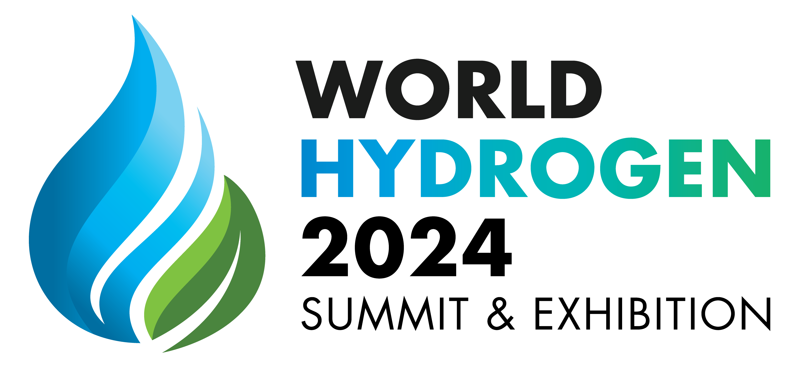
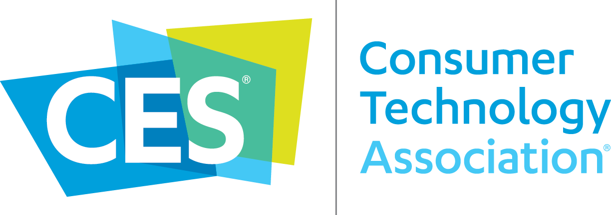

# Our Research Areas + Goals

Just as a bit of orientation, we want to take a second to re-iterate our research goals and describe this website a little bit (where you can find what, and so on). We're a student team of both graduate and undergraduate students here at MIT, heavily connected to the [MIT Precision Engineering Research Group](http://pergatory.mit.edu). Our goal is to understand and evaluate hydrogen-powered vehicles during their entire lifecycle, from end-to-end, and identify gaps in research to close them. But as is the implementation of any solution in the field of energy, answers usually bridge the engineering and regulatory sectors. Therefor, our answers will go past 'good engineering' and also focus on the efforts to develop standards to bring these vehicles closer to reality. **We will use numbers and science to do this.**

Now, a breakdown of this website, in brief.

- On this page, you'll find our research publications, reports, white-papers, conferences, and events.
- On the "Docs" page you'll find engineering resources specific to the current open-source bike we are working on.
- On the "Resources" page you'll find general resources for engineering related to the safe development of hydrogen vehicles.
- On the "Bike" page you'll find informatioin on the current bike, and data from testing.

Any questions, comments, or otherwise, you can always reach out to us at [l2f@mit.edu](mailto:l2f@mit.edu).

## Publications

## White-Papers + Reports

## Events

|  | &nbsp;&nbsp;&nbsp;&nbsp;&nbsp;&nbsp; ||

#### Coming Soon! See you there!

[Hydrogen America's Summit 2023—Washington DC](https://www.hydrogen-americas-summit.com)

#### Future Events

[Consumer Electronics Show 2024—Las Vegas, NV](https://www.ces.tech)

[World Hydrogen Summit 2024—Rotterdam, NL](https://www.world-hydrogen-summit.com)

## Awards

"Best Creative Mod" and "Best in Show" @ the [2023 Wild Rabbit Community Moto Show](https://www.madhousemotors.com/wild-rabbit)