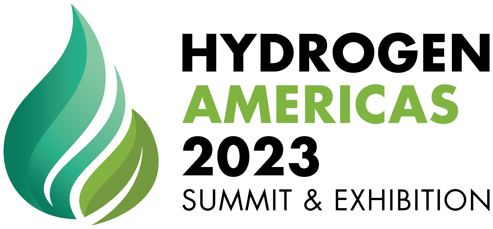

# Our Research Areas + Goals

In the simplest terms, our research goals as a group focus on making Hydrogen work in the real world, and we mean this across their entire implementation-chain. Our full 2023 report on our research goals is linked below, but a short summary of the main points is presented here.

- Much academic research into Hydrogen vehicles is evaluated in simulation due to the high cost to develop and accurately test hardware. 
- Few educational opportunities exist for students to get hands-on experience in Hydrogen (vehicles or otherwise). 
- Infrastructure development is critical, but stalled due to the lack of demand-side applications, many of which are in the prototype stage, and are seeing slow adoption in new applications.
- Demonstration projects by the [IEA's definition](https://www.iea.org/reports/the-need-for-net-zero-demonstration-projects) focusing on hydrogen are slim, and more focus is needed to make Hydrogen systems a reality.

So while we wish to develop vehicle technology to the point of implementation, our research will take into consideration the broader contexts of infrastructure, and resource development for research and education. **Our focus will be to ground ourselves in implementation plans such as the IEA's Net-Zero Emissions by 2050 plan.**

Loading alternative fueling station locator...

<noscript>Please enable JavaScript to view the alternative fueling station locator.</noscript>

###### National Renewable Energy Lab, Map of Alternative Fueling Stations

## Publications

## White-Papers + Reports

## Events

|  | &nbsp;&nbsp;&nbsp;&nbsp;&nbsp;&nbsp; || &nbsp;&nbsp;&nbsp;&nbsp;&nbsp;&nbsp; | |

#### Coming Soon! See you there!

[Consumer Electronics Show 2024—Las Vegas, NV](https://www.ces.tech)

#### Future Events

[World Hydrogen Summit 2024—Rotterdam, NL](https://www.world-hydrogen-summit.com)

#### Past Events

[Hydrogen America's Summit 2023—Washington DC](https://www.hydrogen-americas-summit.com)! See Adi's [interview](https://www.youtube.com/watch?v=ZpDTL_1tm_0) and Ebby's [interview](https://www.youtube.com/watch?v=EJznzb462qE) from HAS 2023.